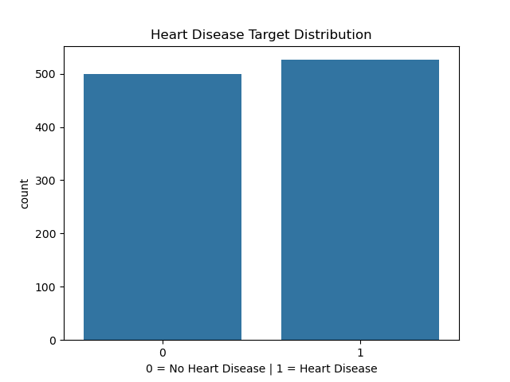
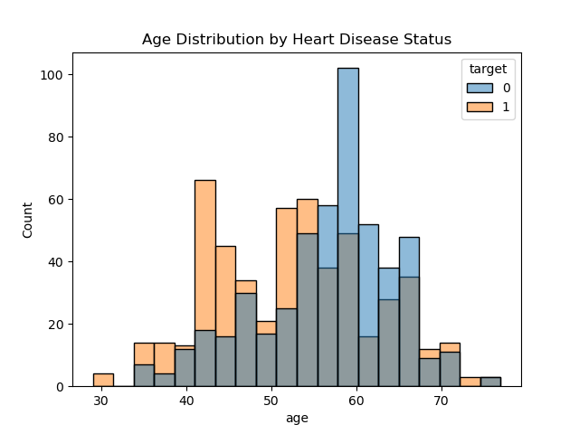
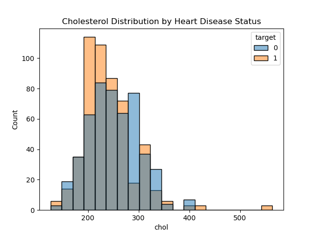
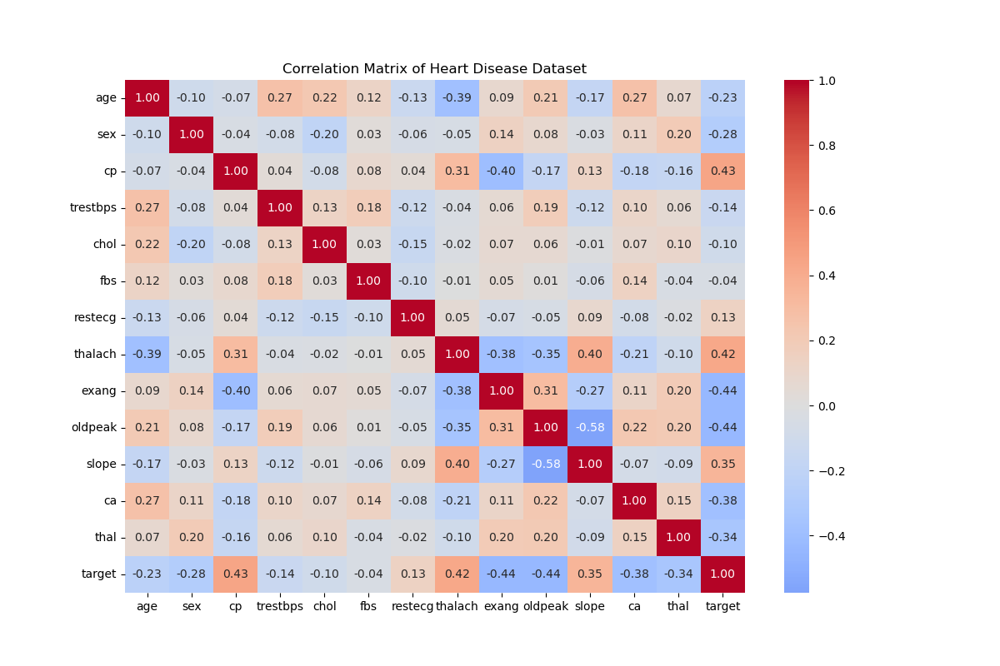
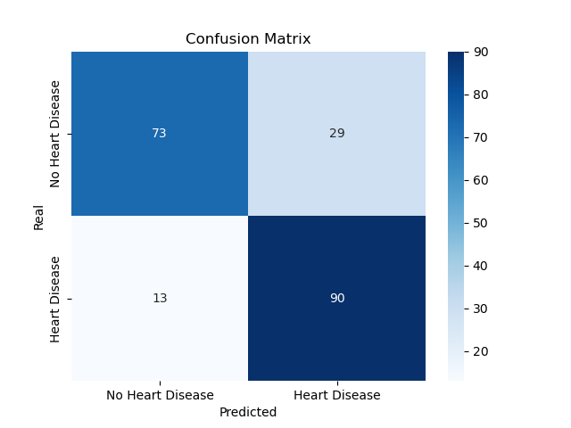

# Heart Disease Classification

A data analysis and machine learning project to predict heart disease 
using clinical data from 1,025 patients.

## Overview
This project explores the [Heart Disease Dataset](https://www.kaggle.com/datasets/johnsmith88/heart-disease-dataset) 
from Kaggle, applying exploratory data analysis (EDA) and a Logistic Regression 
model to predict whether a patient has heart disease based on 13 clinical variables.

## Dataset
- **Source:** Kaggle — Heart Disease Dataset
- **File:** `heart.csv`
- **Patients:** 1,025
- **Variables:** 13 clinical features + 1 target variable
- **Class balance:** 526 with disease (51%) / 499 without disease (49%)
- **Missing values:** None

## Project structure

heart-disease-classification/
├── heart_disease_analysis.ipynb
├── heart_disease_distribution.png
├── age_distribution.png
├── cholesterol_distribution.png
├── heart_rate_distribution.png
├── correlation_matrix.png
├── confusion_matrix.png
└── README.md

## Key findings
- **cp** and **thalach** are the strongest positive predictors of heart disease
- **exang** and **oldpeak** are the strongest negative predictors
- **chol** showed heavily overlapping distributions — weak predictor
- Younger patients (40–55) tend to have heart disease, likely due to selection bias






## Model results
| Metric | Value |
|--------|-------|
| Accuracy | 80% |
| Recall (disease) | 0.87 |
| Precision (disease) | 0.76 |
| False negatives | 13 |



## Libraries
- Python
- Pandas, NumPy
- Matplotlib, Seaborn
- Scikit-learn

## How to run
1. Clone the repository
2. Install dependencies:
```bash
pip install pandas numpy matplotlib seaborn scikit-learn
```
3. Open `heart_disease_analysis.ipynb` in VS Code or Jupyter
4. Run all cells

